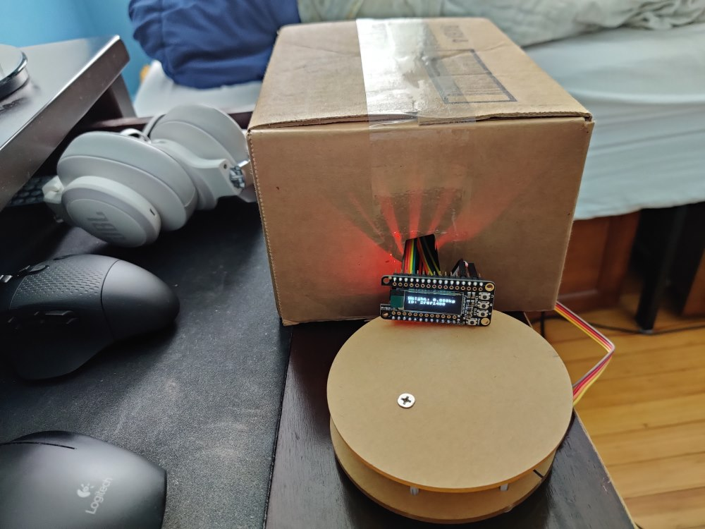
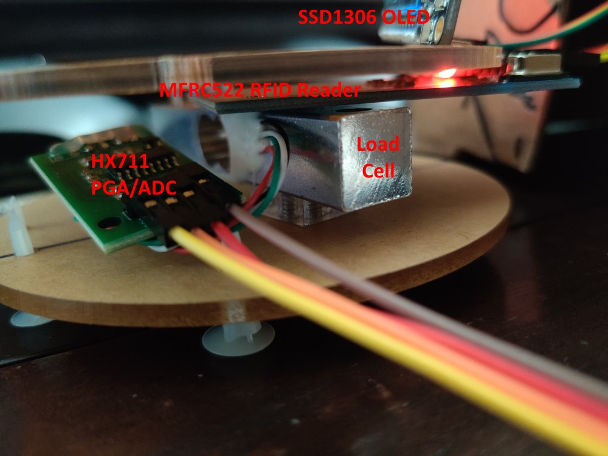

# Nutriscient <!-- omit in toc -->
## The hassle-free food scale <!-- omit in toc -->

# Table of Contents <!-- omit in toc -->
- [Setup](#setup)
	- [Wi-Fi Connection](#wi-fi-connection)
- [Hardware Configuration](#hardware-configuration)
	- [MFRC522](#mfrc522)
	- [SSD1306](#ssd1306)
	- [HX711](#hx711)
- [Starting the System](#starting-the-system)

# Setup
## Wi-Fi Connection
For security and ease of configuration, WiFi credentials are loaded from a separate file. A file called `wifi.txt` should be created, with the first line being the network name (SSID) and the second line being the password. This file can also be uploaded to the ESP8266 via mpfshell using the "put" command.

# Hardware Configuration
The main components of the Nutriscient scale are labelled in the image below.

Connect the wires as follows (note that `3V3` is labelled as `3V` on some ESP8266 boards):

## MFRC522
| MFRC522	| ESP8266	|
| --- 		| ---		|
| 3.3 V		| 3V3		|
| RST		| 3V3		|
| GND		| GND		|
| SCK		| SCK		|
| MOSI		| MOSI		|
| MISO		| MISO		|
| SDA		| GPIO0		|

 

## SSD1306
| SSD1306	| ESP8266	|
| --- 		| ---		|
| 3.3 V		| 3V3		|
| GND		| GND		|
| SCL		| SCL		|
| SDA		| SDA		|
| Button C	| Pin 2		|
| Button C	| (pull-up)	|

 

## HX711
| HX711		| ESP8266	|
| --- 		| ---		|
| 3.3 V		| 3V3		|
| GND		| GND		|
| SCK		| GPIO15	|
| DT		| GPIO16	|

 

# Starting the System
To run the device, simply:

	import measure
from the device's startup file (`main.py`) or via the `repl` of mpfshell.
